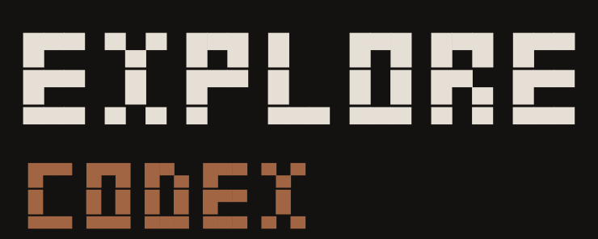
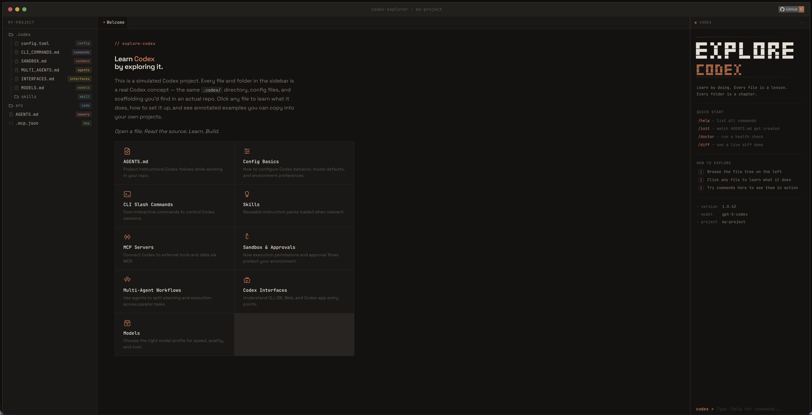

<p align="center">
  
</p>

<p align="center">
  <strong>Learn Codex by exploring it.</strong>
</p>

<p align="center">
  <a href="https://explorecodex.com"></a>
  <a href="https://github.com/wangzhefeng/explore-codex/blob/main/LICENSE"></a>
  <a href="https://github.com/wangzhefeng/explore-codex/stargazers"></a>
  
</p>

---

A simulated Codex project you can click through. Every file and folder in the sidebar is a real Codex concept — the same `.codex/` directory, config files, and scaffolding you'd find in an actual repo. Click any file to learn what it does, how to set it up, and see annotated examples you can copy into your own projects.

<p align="center">
  
</p>

## 📚 What You'll Learn

| Folder / File | Feature |
|---|---|
| `AGENTS.md` | Project memory that persists across sessions |
| `.codex/settings.json` | Permissions, tool access, and guardrails |
| `.codex/commands/` | Custom slash commands for saved workflows |
| `.codex/skills/` | Knowledge folders Codex loads autonomously |
| `.codex/agents/` | Subagents for specialised, delegated tasks |
| `.codex/hooks/` | Shell scripts that run on Codex lifecycle events |
| `.codex/plugins/` | Extend Codex with custom tools and resources |
| `.mcp.json` | MCP server config for external tool integrations |
| `src/` | Example source code sitting alongside real config |

Every piece of content in the explorer is written as if it were a real config file in a real repo. You're not reading *about* the config, you're reading *the config itself*, annotated so you understand every line. When you're done exploring, you can copy the scaffolding straight into your own projects.

## 🚀 Try It

The fastest way to get started is the live site:

**👉 [explorecodex.com](https://explorecodex.com)**

No install, no signup, no build step. Just open it and start clicking.

If you want to run it locally, clone the repo and point any static server at the `site/` directory:

```bash
git clone https://github.com/wangzhefeng/explore-codex.git
cd explore-codex

npx serve site
# or
python -m http.server -d site 8080
# or just open site/index.html directly in your browser
```
## 🏗️ Project Structure

The entire site is static HTML, CSS, and vanilla JavaScript. Zero build steps, zero frameworks, zero bundlers.

```
explore-codex/
├── site/
│   ├── index.html            # Single-page app entry point
│   ├── data/
│   │   └── manifest.json     # Drives the entire UI (tree, content, badges, features)
│   ├── content/              # Source markdown and config files
│   ├── js/
│   │   ├── app.js            # Main controller, routing, keyboard nav
│   │   ├── file-explorer.js  # Sidebar tree with animated canvas connectors
│   │   ├── content-loader.js # Custom markdown parser and renderer
│   │   ├── terminal.js       # Interactive terminal panel
│   │   ├── progress.js       # Feature completion tracking (localStorage)
│   │   └── icons.js          # Hand-crafted SVG icon library
│   └── css/                  # Variables, layout, components, syntax, terminal, void
├── logo.png
└── README.md
```

All educational content is stored in `site/data/manifest.json` and the source files in `site/content/`. The manifest is the single source of truth for the tree structure, badges, feature groupings, and content references. To add or change content, that's where you go.

## 🤝 Contributing

Contributions are welcome! Here are some areas where help would be great:

- **Content** for new Codex features as they ship
- **Accessibility** improvements (keyboard nav, screen readers, ARIA)
- **Mobile** experience refinements
- **Translations** into other languages

If you'd like to add or update educational content, the two places to look are:
1. `site/data/manifest.json` for tree structure and metadata
2. `site/content/` for the actual markdown and config files

Feel free to open an issue if you have ideas or spot something that could be better.

## ⭐ Support

If you found this useful, consider giving it a star! It helps others discover the project.

## 📄 License

[MIT](LICENSE)
